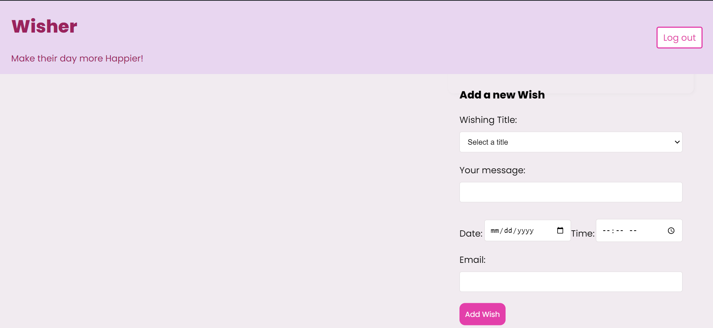
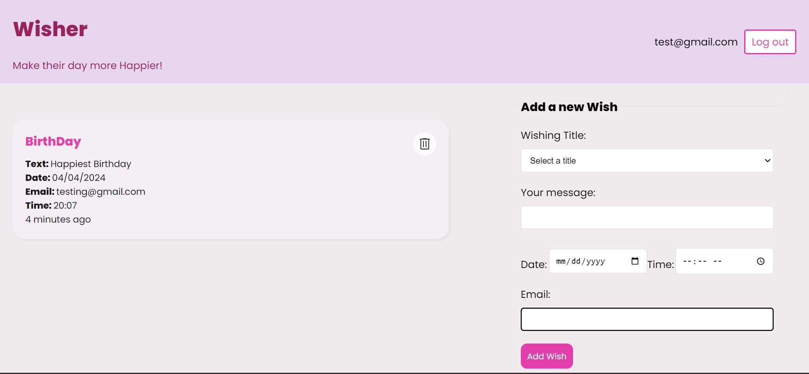
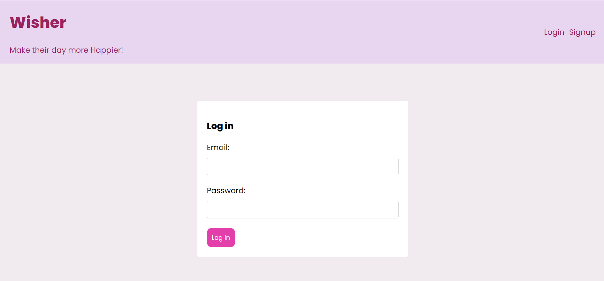
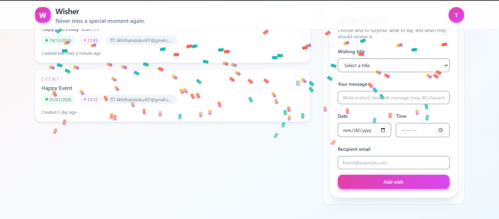
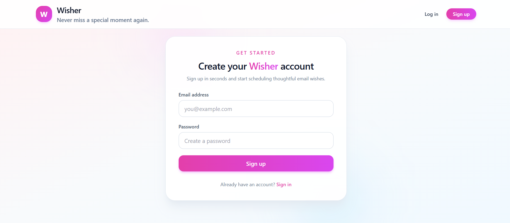

# Wisher

    

## Contents
1. About 
2. Tech Stack
3. Gallery
4. How It Works
5. Future Work
6. Contributions
7. Website 
8. License

## About
- **Effortless wishing**: Wisher lets you schedule personalised email wishes for birthdays, anniversaries, and other special moments at an exact date and time.
- **Never miss an occasion**: All upcoming wishes are shown in a simple timeline so you always know what is scheduled next.
- **Streamlined management**: Add recipients, write messages, and manage or cancel scheduled wishes from a single clean interface.
- **Secure and reliable**: Your data is stored in MongoDB and emails are delivered using a trusted SMTP provider.

## Tech Stack
- **Frontend**: React, Tailwind CSS
- **Backend**: Node.js, Express.js
- **Database**: MongoDB (Mongoose)
- **Scheduling & Email**: node-schedule, Nodemailer (SMTP)

## Gallery

    

    

    

    

    

    

## How It Works
- **1. Create an account**: Sign up with your email to get a secure, private space for your wishes.
- **2. Add a wish**: Choose a recipient email, write your message, select the occasion date and time, and save.
- **3. Wisher schedules it**: The backend uses `node-schedule` to register a one-time job for the selected date and time.
- **4. Email is delivered**: At the scheduled moment, Wisher sends your message automatically using Nodemailer over SMTP.

## Future Work
- **Admin dashboard**: Monitor data, manage users, and detect or prevent spam or misuse of the platform.
- **Recommendations**: Suggest relevant wishes or templates based on user history and interactions.
- **More channels**: Explore delivery via additional channels (e.g. SMS or messaging platforms) while keeping email as the primary flow.

## Contributions
- All contributions and suggestions are welcome.
- Start with issues, and for more features write to <a href="mailto:likhithaindukuri07@gmail.com">likhithaindukuri07@gmail.com</a>.

## Website

- <a href="">Wisher</a>

## License
- ***GNU GENERAL PUBLIC LICENSE***

