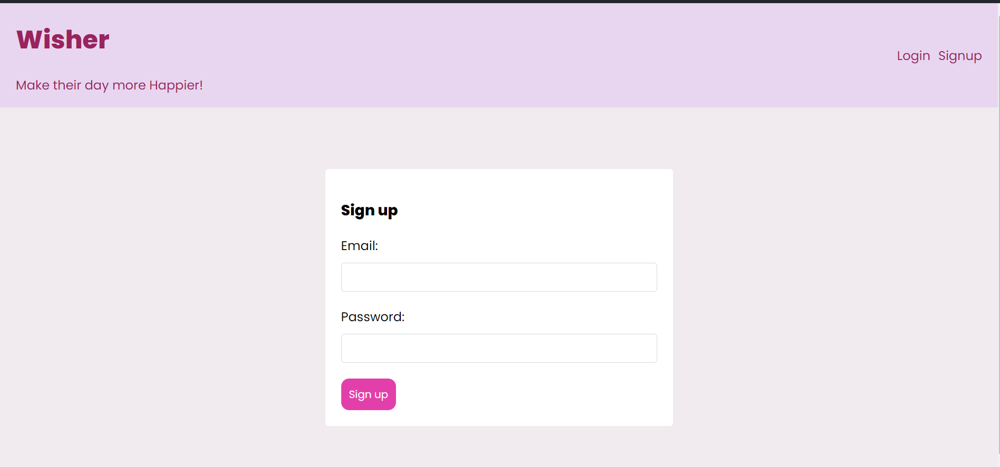

# Wisher

    

## Contents
1. ABOUT 
2. TECH SLACK
3. GALLERY
4. FUTURE WORK
5. CONTRIBUTIONS
6. WEBSITE 
7. LICENSE

## About
- Effortless Wishing: Wisher simplifies the process of sending wishes by allowing users to schedule personalized messages to be sent via email at specific times.
- Never Miss an Occasion: With Wisher, you can ensure that your loved ones receive your wishes on time, every time, eliminating the risk of forgetting important dates.
- Streamlined Management: Manage recipients' email addresses, craft personalized messages, and schedule wishes all within one convenient platform.
- Secure and Reliable: Your data and wishes are kept safe and secure, allowing you to send heartfelt messages with peace of mind.

## Tech Slack
- [HTML](https://html.com/)
- [CSS](https://www.free-css.com/)
- [Javascript](https://www.javascript.com/)
- [BootStrap](https://getbootstrap.com/)
- [Nodejs](https://nodejs.org/en/)
- [Expressjs](https://expressjs.com/)
- [MongoDB](https://www.mongodb.com/)
- [Reactjs](https://react.dev/)

## Gallery

    

    

    

    

## Future work
- Admin Dashboard: Develop an admin dashboard to monitor data, manage users, and detect and prevent spam or misuse of the platform.
- Recommendation System: Integrate a recommendation system to suggest relevant wishes to users based on their preferences, history, and interactions.
- UI/UX Refinement: Invest in UI/UX development to enhance user experience and interaction, making Wisher more intuitive and enjoyable to use.

## Contributions
- All contributions and suggestions are welcome .
- Start with issues and for more features write to <a href ="mailto:likhithaindukuri07@gmail.com">likhithaindukuri07@gmail.com</a>

## Website

- <a href="">Wisher</a>

## Licence
- ***GNU GENERAL PUBLIC LICENSE***

